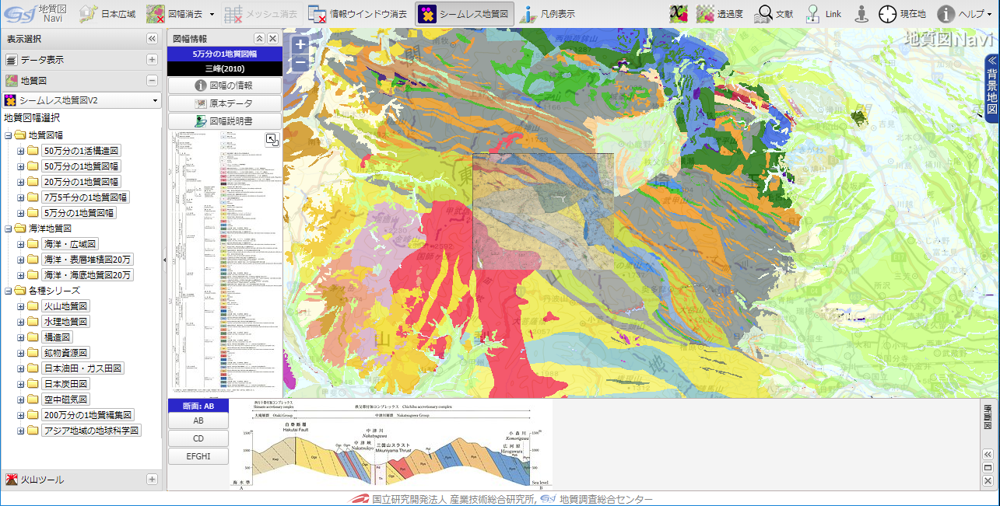
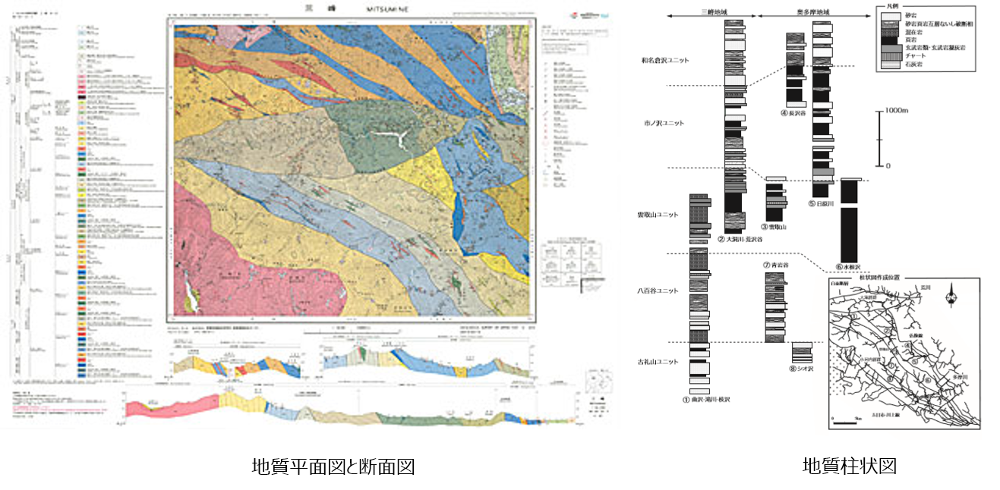

# 1. 地質図とは何か

## 地質図とは

* 地質図とは、「表土の下にどのような種類の石や地層がどのように分布しているか」を示した地図のことです。　　
* 地表付近にある動植物や建造物、雲、表土などはは無視され、その基盤となる石や地層とその構造を描いた分布図です。  

## 地質図整備の歴史

地質図作成には現地調査が必須であることからその作成には多大な労力と時間を要します。  
明治15年に創立された地質調査所（現 [産総研 地質調査総合センター（GSJ）](https://www.gsj.jp)）は、日本で一番長い歴史を持つ国立研究所ですが、地学基礎研究および近代日本の国土開発・保全や産業振興として、設立以来、全国の地質図の整備を行ってきました。  
GSJが発行する地質図は「地質図幅」と呼ばれ、現在では20万分の1地質図幅は全国を網羅し、5万分の1縮尺は国土の約70%をカバーしています（[地質図カタログ](https://www.gsj.jp/Map/index.html)）。  
また、近年ではオープンデータ化により研究成果の2次利用が行いやすくなってきており、各種の地質図もWebで公開（[地質図Navi](https://gbank.gsj.jp/geonavi/geonavi.php)）されています。

## 地質図の種類と表現

地質図は、上記のような国家機関によるもの以外に、各地の都道府県などの地方公共団体や研究機関、建設業や鉱工業企業などでも、目的に応じて作成されています。  
一般的には、**地質平面図**、**地質断面図**、**柱状図**などで表現され、多くは、調査地域の地質の観察結果や特徴を記した**調査報告書**を伴っています。

## 地質図で分かること

* 学術利用：地史、地球の古環境、生命の進化、地形の成り立ち 等
* 産業利用：国土開発・保全、資源開発、防災 等 

## 地質図の作成とフィールド調査

地質図は、地面の下にある物質の分布を表現しています。そのため、地表に現われている露頭の直接的な観察記録を直接証拠として、観察できないところは他のデータや地質図学といわれる図法を用いて推定して作図をすすめていきます。

地質図を作成する（地質を知る）には以下のポイントを押さえておいてください。

* 地質学は古くて新しい学問（常に足元にあるものなのに、あまりよくわかっていない）
* 実験での再現が困難なため、観察・観測データを積み重ねて推論することが重要
* アナログ的な手法（綿密な観察記録）とデジタル的な手法（ビッグデータの解析）をいかに融合させるかが地質学研究にとって必要

本講座では、地質図を作成するために特に重要となる以下の内容について主に解説します。

* フィールド調査法
* 地質図学を用いた地質図の作成

### 【演習1】地質図の作成にはどのような調査が必要か理解する

任意の5万分の1地質図幅および調査報告書を閲覧して、どのようなことが記述されているか、またどのような調査を行ったかをまとめてみましょう。

5万分の１地質図幅は産総研地質調査総合センター ホームページの[「地質図カタログ」ページ](https://www.gsj.jp/Map/JP/geology4.html)より閲覧することができます。

