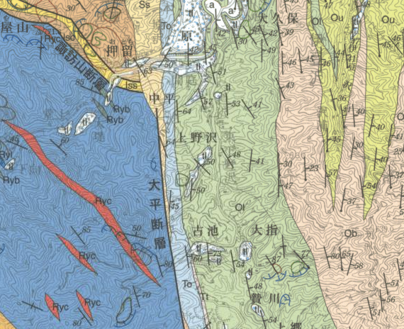
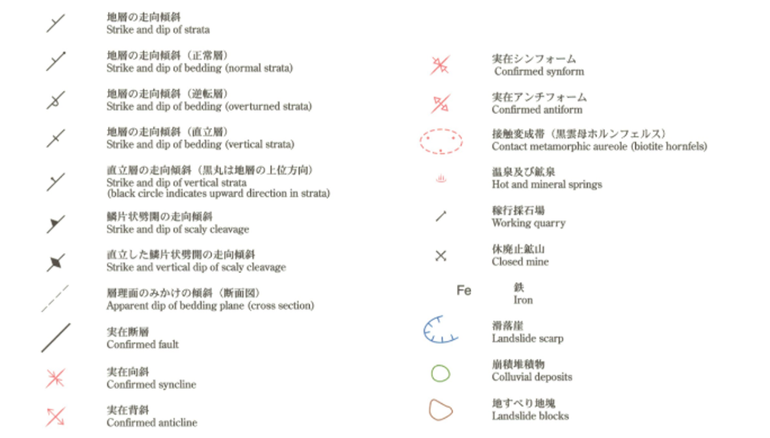
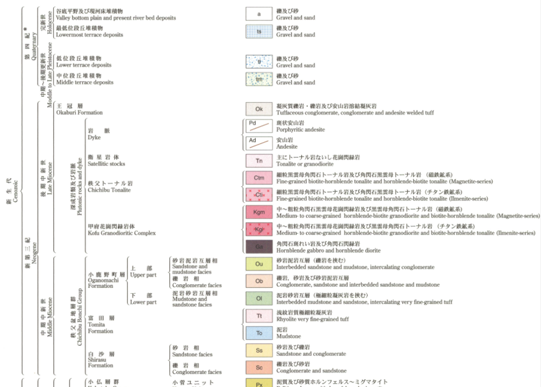

# 3. 地質図の読み方

地質図は、地質調査で得られた情報を基に種々の地質学的見地や地質図学によって地質構造を解析した結果を記載したものですが、地質のすべての情報を見ることは不可能であるため、断片的な事実に基づく「解釈図」です。  
そのため、得られた地質情報の精度や作成者の解釈によって同一地域の地質図でも図面の内容に差異が生じたり、新たな事実や学説の進展により再作成される場合があります。

また、目的や精度（あるいは作成者の思想・文化）によっても地質図の表現や記載は異なっているため、地質図を読むときは、その地質図が作成された目的や年代などを確認するようにしましょう。

地質図のJIS規格化などの標準化も進められていますが、現在では記載の統一はまだ進んでいません。

  
地質図幅の例（5万分の1地質図幅「三峰」の一部）

## 地質構造

地層の走向・傾斜、褶曲、断層等の記号により地質構造を表現しています。  

  
地質構造を表す記号の例（5万分の1地質図幅「三峰」の一部）

## 岩相および地質年代

岩相や地質年代ごとに色分けをして表現しています。

  
岩相および地質時代を表す凡例の例（5万分の1地質図幅「三峰」の一部）

### 【演習1】地質図を読む

任意の5万分の1地質図幅を閲覧して、その中のある特定地域の地質について以下の観点から簡潔に記述してみましょう。

* 分布している地層の種類（岩相）と地質年代
* 各地層の主な関係（地質構造）

5万分の１地質図幅は産総研地質調査総合センター ホームページの[地質図Navi](https://gbank.gsj.jp/geonavi/geonavi.php)より閲覧することができます。

