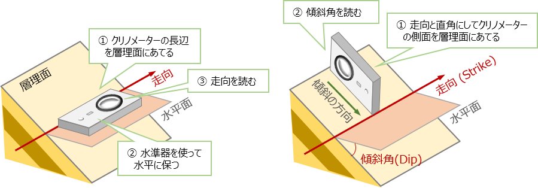

# 2. 地質調査法

地質現象は、室内での実験や再現することが困難です。そのため、地質の研究には **フィールドワーク** が必須です。  
特に地質図の作成は、**フィールド調査に始まり、フィールド調査に終わります**。

## 地形図と地形の観察

フィールド調査を行う際には、地形図で自分が調査している場所の位置や周辺の地形の特徴を正しく把握する必要があります、そのためには、地形図を正しく読み取れることが重要です。

### 地形図を読むための基本

調査では野外（現地）で地形図を読んで自分の位置や方角を把握します。 そのため、地形図に記されている記号や凡例の意味を理解しておくことはもちろんですが、実際の地形が地図上ではどのように記されているのかを読み取れるようにしましょう。  
フィールドでは5千～1万分の1の縮尺の地図をよく使用します。このとき、以下のように自分の位置や方角を把握するようにします。

* 例えば、1万分の1の縮尺であれば、1mmは10ｍになる。自分の歩測で10ｍは何歩にあたるのかを予め知っておく。
* 道路の曲がり、合流点や建物などの地形図上の位置と、実際の場所を常に把握するようにする。
* 人工物がない場合は、等高線を読み取り川や谷の合流場所等から位置を特定する。
* 最近はポータブルGPS機器により位置特定が行えるが、山林や障害物により信号が遮断されている可能性があるので、必ず地形図上での位置確認も行う。

### 地形図から調査予定ルートを選定する

地形図の等高線を読み取ると、尾根筋、谷筋、水系などの特徴が判ります。これらの地形の特徴を見極めて、調査目的に合致したおおよその調査ルートを定めておきます。

* 効率的に露頭が多く露出していそうな場所をルートに選ぶ（例えば、古期岩類の調査を行うのに、段丘の上の平面を歩いていても露頭は見つからなない）
* 地形は地質の影響を受けていることが多いので、地形が急変するところは、地質の境界付近である可能性がある

## 野外地質調査（フィールド調査）

* 野外調査の準備  
  * 調査における注意点
  * 調査道具以外で準備しておくもの
* 調査道具
  * 測定道具
  * 採取道具
  * 記録道具
* 露頭での観察
  * 位置の確認
  * 観察・測定
  * 記録
* 調査結果の記録
  * ルートマップの作成
  * 柱状図の作成
  * 地図上への記録とフィールドノートへの記載
  * スケッチと写真

## 岩石・鉱物の観察と鑑定

実際の露頭では、風化や植生、人工物の混合などにより標本のようなきれいな岩石に出会うことはめったにありません。  
ハンマーできれいな面を出してルーペで確認し、以下のようなことをその場で判断します。 現場で判断できなような場合は、サンプルを持ち帰り室内で分析を行います。

* 堆積構造の観察
  * 地層間の関係
  * 地層内の岩石構造
  * 古環境を示す構造
* 岩石の観察と分類（堆積岩類／火成岩類／変成岩類、二次堆積・生成物の見極め）

## 化石の観察と鑑定

大型化石を発見したら、いきなり取り出さずまずその参状をスケッチや写真で記録します。 化石を取り出すときは、壊さないように慎重に取り出してください。また、有名な化石産地は採取禁止となっていることが多いので、そのような場所でハンマーを扱って採取することはやめましょう。  
ルーペでも観察できない微化石の場合は、化石が含まれていると思わる岩石サンプルを採取して室内にて処理をして取り出します。

* 化石の採取と処理
* 生痕化石の観察
* 化石の同定

## 物理探査

近年では物理地質探査の手法や精度も向上してきており、地質図の作成や地質の成り立ちを理解するのに大いに役に立ちます。  
しかし、物理探査の結果は地下物質の物理的特徴の一面のみを表した結果であるため、そのデータのみで地質を解釈することは危険です。 フィールドとの観察結果と対比したうえで総合的に解釈することが重要です。

### 【演習1】クリノメーターでの面構造の測定法を理解する

クリノメータによる走向・傾斜の測定方法をマスターしましょう。

### 【演習2】クリノメーターでの線構造の測定法を理解する

クリノメータによる線構造（トレンド・プランジ・レイク）の測定方法をマスターしましょう。

