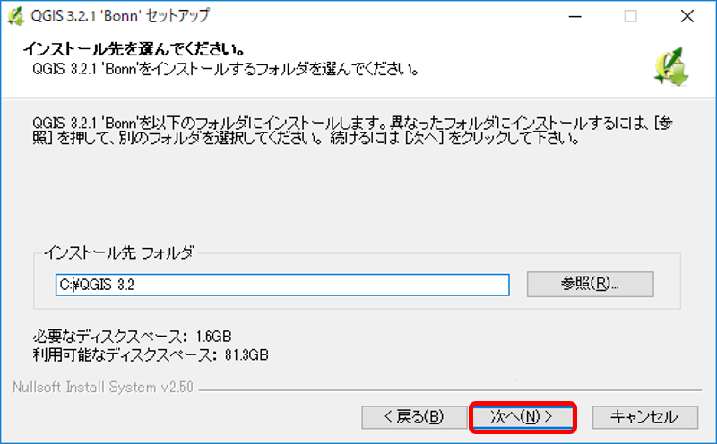
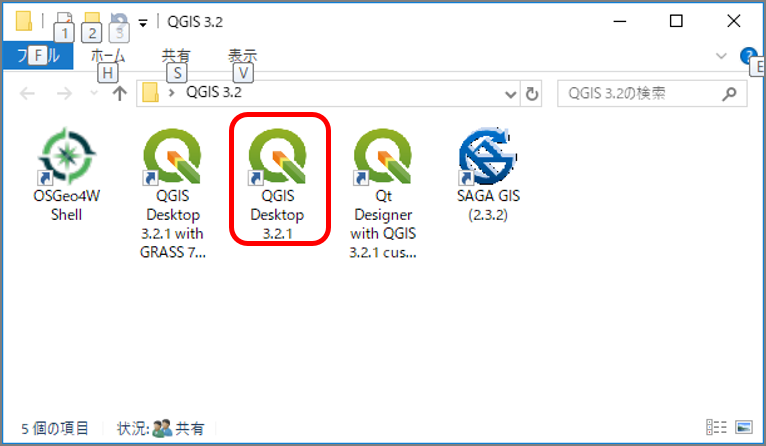

# 5. QGISのインストールと使用方法

## QGISとは

QGISは、WindowsやMac、Linuxなどクロスプラットフォームで稼働するオープンソースのGISソフトです。  
GISデータの作成・編集・閲覧・分析など、商用のGISソフトに匹敵する一連のGIS機能を持っており、プラグインを使用することにより機能を強化することもできます。

### 【QGISの特徴】

* GNUライセンス（オープンソース）のため無料で使用可能 
* OSGeo（Open Source Geospatial Foundation）のオフィシャルプロジェクト
* Lunux, Unix, Mac OSX, Windows, Andoidのクロスプラットフォーム で動作
* 数多くのベクター、ラスター、データベースフォーマットや機能をサポート
* 有料・高額なGISソフト（代表的なものはArcGIS）に近い機能・操作性
* プラグインで機能を追加することが可能  

本講座ではこのQGISを用いて地質図の作成を行います。  
まずご自身のPCにQGISをインストールして、地質図の作成環境を準備しましょう。

## QGISの動作環境とインストール

QGISは、「[QGISプロジェクト](http://qgis.org/ja/site/)」のWebサイトから最新バージョンをダウンロードしPCにインストールして無料で使用することができます。 本講座では **バージョン3.x** を使用しています。  
以下の手順でQGISプロジェクトサイトからインストーラをダウンロードして、PCにインストールしてください。

> 【QGISを快適に動作させるのに必要なPCのスペック（Windowsの場合）】  
> QGISは画像を多用するため、それなりのスペックのPCでないと快適に動作してくれません。  
> 調査時の携帯性を優先して軽量小型のノートPCを持って行ったはよいが、サクサク動かずに余計に手間がかかってしまっては意味がありません。なるべく高スペックのPCが望ましいのですが、ある程度のスペックが必要となりますので、下記を参考にインストールするPCを選定してください。  
>   
> ・画面の解像度は最低 1024×768 は必要です。ノートPCの場合はこれより小さい場合が多いので注意してください。  
> ・メモリは最低4GB（Windows10の場合）あったほうがよいです。  
> ・ 空ストレージ容量は、最低２GB必要です。また、地物データ量が多くなるとデータの読み書きで時間がかかるため、SSDタイプのストレージの方が望ましいです。  
> ・地物の描画にはマウスが必須です。マウスを忘れないで持っていくようにしましょう。

### 【実習1】QGISをインストールする

QGISをPCにインストールして使用できるようにしてください。  
Windows10の場合のインストールの手順は以下の通りです。

#### 1.QGISのインストーラをダウンロードする

① 以下のQGISプロジェクトのサイトより **[ダウンロードする]** をクリックします。 [https://www.qgis.org/ja/site/](https://www.qgis.org/ja/site/)

  
QGISプロジェクトホームページ（[ダウンロード]をクリック）

② ダウンロードページで、「Windows版のダウンロード」の中にある **[QGISスタンドアロンインストーラ Version 3.x]** をクリックして、インストーラファイルをPCの任意の場所にダウンロードします。  
インストールするファイルは、PCの環境（32bitまたは64bit）に応じて最適なものを選択してください。  

  
インストールするファイルを選択してクリック）

③ **「名前を付けて保存」ダイアログ**が表示されるので、PCの任意の場所にインストーラファイルを保存します。  

  
ダウンロードファイルを任意の場所に保存）

#### 2.QGISをインストールする

① ダウンロードしたインストーラファイルを選択してインストールを実行します。  
このとき、Windowsの実行ユーザーに管理者権限がないとうまくインストールできないことがあるので、ファイル名を右クリックして、**\[管理者として実行\]** をクリックするようにします。

  
ダウンロードしたファイルを実行する

実行すると、「このアプリがデバイスに変更を加えることを許可しますか？」のメッセージが表示されたら \[はい\] をクリックしてください\)。

② セットアップウィザード画面が表示されたら \[次へ\] をクリックしてください。

  
セットアップを開始する

③ ライセンス契約書の画面が表示されたら \[同意する\] をクリックします。

  
ライセンスに同意する

④ QGISをインストールするフォルダを指定して \[次へ\] をクリックします。  
特にこだわりがなければ、既定で表示されているフォルダをそのまま指定しても問題ありません。

  
インストール先を指定する

④ インストールコンポーネントはQGIS本体のみ（デフォルトで指定されている）を選択します。\[インストール\] をクリックすると、インストールプロセスが開始されます。

  
コンポーネントを指定する

  
インストール中  

## QGISの基本的な使い方

### 1.QGISを起動する

インストールが完了すると、デスクトップに起動リンクが格納されたフォルダが作成されます。 このフォルダ内の **「QGIS Desktop 3.x.x」** をダブルクリックするとQGISが起動します。（「3.x.x」はインストールしたバージョンです）

  
デスクトップの起動アイコン  

### 2.QGISのウィンドウの構成を理解する

QGISのウィンドウ構成は以下の通りです。  
① メニューバー：各種機能を呼び出すメニュー  
② ツールバー：各種機能を呼び出すアイコン（表示・非表示が制御できます）  
③ パネル：マップの表示や操作を行う操作パネル（表示・非表示が制御できます）  
④ マップウィンドウ：地図を表示するウィンドウ  
⑤ ステータスバー：表示されている地図の各種状態を表示

  
QGISの画面構成  

### 3.基本的な使い方とプロジェクトファイルの構成を理解する

QGISで地図を表示・編集するには、まず「プロジェクトファイル」を作成しなければなりません。

QGISで地図を作成する基本的な手順は以下の通りです。  
1. プロジェクトファイルを新規に作成する。または、既存のプロジェクトファイルを読み込む。 2. 地図レイヤーを追加する。 3. レイヤー内の地物の追加・編集を行う。 4. 保存する。

プロジェクトファイルは、ベクターデータやラスターデータそのものを保存しているわけではなく、各データファイルへのリンク情報のみ保持していることに注意してください。 そのため、作成した地図データを他のPCやフォルダに移行したりコピーする場合は、「相対パス」でリンク情報を保持しないとそのまま移行ができません。  
プロジェクトファイルの定義は\[プロジェクト\]-\[プロパティ\]を開いて確認することができます。

### 4.各種地理空間情報の入手とQGISへの取り込み方法を理解する

* 主な地図情報 ：タイル形式で提供されている情報は、ブラウザパネルの「XYZ Tile」に接続して取得することができます。
  * 地理院タイル
  * Google Map
  * Open Street Map
* 基盤地図情報：[国土地理院のサイト](http://www.gsi.go.jp/kiban/index.html)からダウンロードして入手できます（ユーザー登録が必要です）。ダウンロードしたデータを加工してQGISに取り込むことができます。
  * 標高データ（DEM）を入手したい場合はここからダウンロードします。  
* 国土数値情報：[国土交通省のサイト](http://nlftp.mlit.go.jp/ksj/)からダウンロードしてQGISに取り込みことができます。地形、土地利用、公共施設などの国土に関する基礎的な情報が載っています。  
* 画像データのジオリファレンス：QGISメニューの **[ラスタ]-[ジオリファレンサ]** で、画像データの位置合わせを行って地図に重ねることができます。 

### 【実習2】QGISの基本的な使い方を理解する

インストールしたQGISを起動して、自分のいる場所の国土地理院地図を表示させてみましょう。

