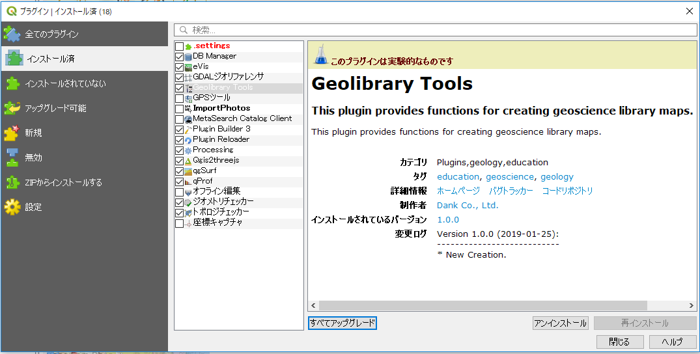

# 6. QGISによるデジタル地質図の作成

## プラグインを使用した地質図作成  

QGISを用いて地質図を作成する場合、QGISの操作や機能の理解にかなり熟知しなければなりません。  
そこで、地質図の作成に必要な機能を専用メニューに盛り込んだ「地学ライブラリツール」プラグインを開発しました。

このプラグインは、QGISで地質図の作成が容易に行えるよう、以下のような機能を実装しています。

* プロジェクトの作成時に「シナリオ」「主題図」などのレイヤーグループを自動的に生成。  
* 主題に合わせたテンプレートを使用してレイヤーを追加可能。地質図などの特定の主題図を作成する際の地物属性やシンボル（走向・傾斜属性等）があらかじめセットされています。  
* 地物の編集でよく使うツールを「編集ツール」としてツールバーに設定。また専用の地物属性編集ウィンドウを用意し、効率よく地物の編集が行えます。  
* 走向線の自動描画機能を実装。地質図の作成が効率よく行えます。  
* シナリオマップの地物には外部ファイルをリンク。マップを使用したプレゼンテーションが行えます。  
* 作成された地図をWebマップ（「Web地学ライブラリ」仕様に準拠）へのエクスポートが可能（現バージョンでは未実装）。作成した地図を共有して閲覧することができます。  

## QGISプラグインをインストールする

現バージョンの「地学ライブラリツール」プラグインは、公式プラグインではないため、QGIS公式プラグインサイトでは公開されていません。  
提供されたZIPファイルまたは本プラグインの専用リポジトリサイトからインストールをして下さい。

### 【演習1】プラグインをインストールする

以下のような手順で、PCのQGISに「地学ライブラリツール」プラグインをインストールしましょう。
(a または bのどちらかの方法でインストールしてください。)

#### a) ZIPファイルからインストールする場合

① 以下のリンクをクリックして、zipファイルをダウンロードします。

[**geolib3ダウンロード**](https://gis.nsb-dank.co.jp/ggis/geolib3.zip)  

② QGISを起動し、**[プラグイン]-[プラグインの管理とインストール]** をクリックします。  

  
プラグイン管理ダイアログを開く  

③ 「ZIPからインストールする」タブをクリックして「ZIPファイル」に①でダウンロードした地学ライブラリツールプラグインのアーカイブファイル（geolib.zip）を指定して \[プラグインをインストール\] をクリックします。  
  
ZIPファイルを指定してインストール  

#### b) プラグイン専用リポジトリからインストールする場合  

① QGISを起動し、**[プラグイン]-[プラグインの管理とインストール]** をクリックします。  

  
プラグイン管理ダイアログを開く  

② 「 設定」タブをクリックして「プラグインリポジトリ」に地学ライブラリツールプラグインのリポジトリを以下のように設定して接続します。

    名称：「Geolibプラグイン」と入力  
    URL：https://gis.nsb-dank.co.jp/qgis/plugins.xml  

  
Geolibプラグインリポジトリに接続する  

③ 「全てのプラグイン」または「インストールされていない」タブで、「地学ライブラリツール」を選択して **[インストール]** をクリックしてプラグインをインストールします。 

   
インストール後の状態  

#### プラグインが有効であることを確認する  

④ 「インストール済」タブを開いて、「Geolibrary Tools」がインストールされていることを確認し、左横の□にチェックをつけて有効化します。  

  
プラグインが有効であることを確認  

メニューに「Geolibrary Tools」メニューが追加され、ツールバーも追加されたら、「地学ライブラリツール」を使用できます。

  
プラグインのメニューとツールバー  

## QGISプラグインを使う

地学ライブラリツールプラグインの詳しい操作方法は「ヘルプ」ファイルを参照してください。ツールバーのヘルプアイコンをクリックすると、ヘルプファイルが表示されます。

### 【演習2】プラグインの使用方法を理解する

「地学ライブラリツール」プラグインを使用して、プロジェクトファイルを作成してみましょう。

#### 1. 使いやすいようにオプションを設定する

① メニュー **[設定]-[オプション...]** をクリックします。

  
オプションダイアログを開く  

② 「**一般情報**」タブで、 「**システムロケールを上書きする**」にチェックをして、使用するロケールに「**日本語**」を指定します。

  
システムロケールの設定  

③ 「**デジタイズ**」タブをクリックします。

  
デジタイズの設定  

④ 「**地物の作成**」の「**地物作成後に属性フォームをポップアップしない**」にチェックします。

⑤ 「**スナップ**」の「**デフォルトでスナップを有効にする**」にチェックします。

⑥ **[OK]** をクリックしてオプション画面を閉じます。

その他、様々なオプション設定ができます。 必要に応じ、使いやすいように設定を変更して使用ください。

#### 2. プロジェクトファイルを準備する

通常、QGISの **\[プロジェクト\]-\[新規作成\]** からプロジェクトを作成すると、何も表示されない真っ白な画面となり、何から始めてよいのかわかりません。

地学ライブラリツールの **\[Project Tool\]-\[New\]** からプロジェクトを作成すると、地質図作成に必要なレイヤーグループや背景地図レイヤが自動的に作成されます。

  
プラグインのプロジェクト作成ダイアログ  

  
プロジェクト作成直後の画面  

#### 3. レイヤーを追加する

レイヤーの追加は **\[Layer Tool\]-\[Add Layer\]** から行います。

  
プラグインのレイヤー追加ダイアログ  

  
レイヤー作成後のレイヤーパネル  

#### 4. 地物の追加・編集を行う

作成したレイヤーに地物データの追加・編集を行うには、レイヤーパネルで編集したいレイヤーを選択したうえで、地学ライブラリツールプラグインの「**編集ツール**」を使って行います。 

  
地物の編集・追加  

編集ツールの詳細な使い方についてはプラグインのヘルプを参照ください。

