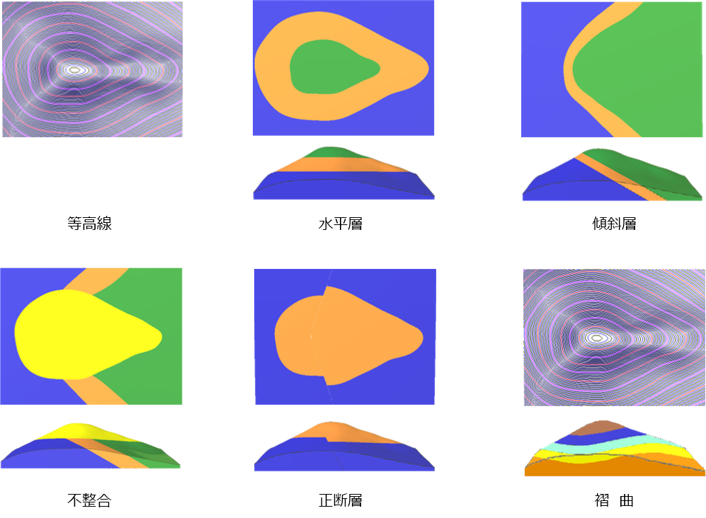
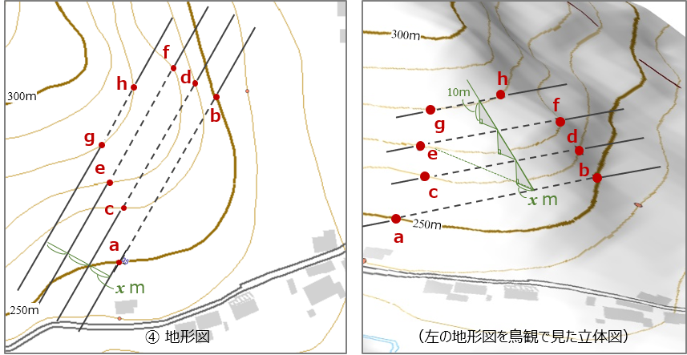
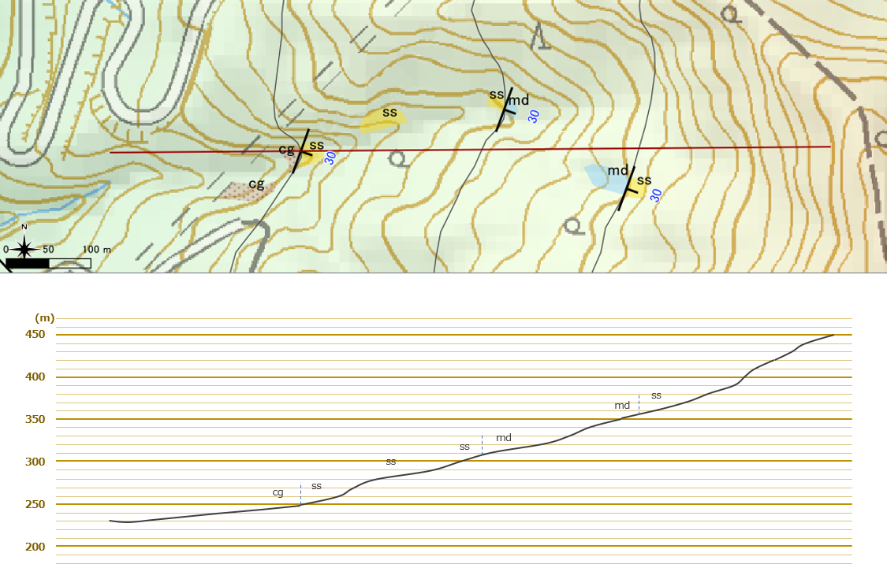

# 7. 地質図学演習（境界線の描画）

## 地形図上での地質境界線の描画

地質構造の違いにより、同じ地形でも地表での地層境界線の表れ方が変わります。  
地質図の読む力がつくと、等高線が描かれている地質平面図上に描画された地質境界線を見てどのような地質構造となっているか想像できるようになります。 また、地質構造の違いから、地表で地質境界線がどのように表れるかが予想できるようになります。

  
<sup>地質構造の違いによる地表での地層境界線の表れ方</sup>  

上図の褶曲ではどのような地質境界線となるでしょうか？

### 地層面の走向・傾斜と地層境界線の関係

層理面が表われる標高を表した線を**走向線**といいます。  
層理面が平面と仮定した場合、下の図のように、走向線は走向方向と平行な線となります。そのときに、走向線間の間隔（距離）は傾斜角から求めることができます。

  
<sup>傾斜角と走向線間の距離の関係</sup>  


```text
d = h / tan θ （d:走向線間隔 h:等高線間隔 θ:傾斜角）
```

地形図上で地層境界線を推定するには、下図のように地層境界の露頭の走向・傾斜から走向線を引き、同一等高線と交わる点を結んでいくことによって描画していきます。（x=10/tan 35° = 約14ｍ）

  
<sup>地層境界線を描画する</sup>  

### 【演習１】走向線の意味と描画方法を理解する

紙の地形図上に地質境界線を描画してみましょう。  
* 平らな地層面（単斜構造など）の境界線の描画
* 褶曲・断層の描画  
を行ってください。

  
<sup>境界線を描画する（１）断層を含む傾斜層</sup>  

  
<sup>境界線を描画する（２） 褶曲を含む傾斜層</sup>  


### 【演習２】QGISを使用した走向線の描画方法を理解する

QGISのサンプルプロジェクトファイルを使用して、QGISで地質境界線を描いてみましょう。  

* 露頭の層理面の走向・傾斜から地質境界線を描画
* ３点の同一層理面の露頭の標高から地質境界線を描画（３点図法）

## 地質断面図を作成する

地質の地下構造を把握するためのは**地質断面図**を作成します。  
地質断面図は、ある２地点を結んだ切断線に沿った地形断面図上に、地表の地質データをもとに、地下の地質分布を推定して描いていきます。

  
<sup>地質断面図の例（5万分の１地質図幅「三峰」より）</sup>  


このとき、地表の地層の傾斜方向と断面線の方向が一致している場合はその傾斜角で地下まで地層が伸びていると想定してよいのですが、一般には傾斜角方向と断面線の方向が一致することはまれです。  
そのため断面線における地層の**見掛けの傾斜**を求めたうえで断面図を作成する必要があります。

### 見掛けの傾斜

見掛けの傾斜を求めるには、以下の計算を行います。

  
<sup>見掛けの傾斜</sup>  

### 地下の地質構造を作図する

地表で見られた地層は地下でもそのまま直線上に延長しているわけではなく、過去の地質変動による構造となっています。 すなわち、走向や傾斜や層厚の変化、褶曲、断層、不整合などによる地下構造を推定して描画する必要があります。

地上で観察された走向・傾斜から図法によって作図する方法には、**バスク法**、**三井法**などいくつかの手法があります。  
ここでは、これらの手法については解説しませんので、詳しく知りたい場合は、他専門書を参照ください。

### 【演習３】見掛けの傾斜の求め方を理解する

フィールド調査を行い、下図のようなルートマップを作成しました。 ここで、礫岩と砂岩の境界が見られる露頭（境界面の走向・傾斜はN20E）を東西を切る（赤線）の地質断面図を作成しようと思います。

  
<sup>見掛けの傾斜を求める</sup>  

（１） 断面図上の地層の見掛けの傾斜を計算しましょう。

（２）断面図を描画してみましょう。

[演習用ワークシート]をダウンロード

