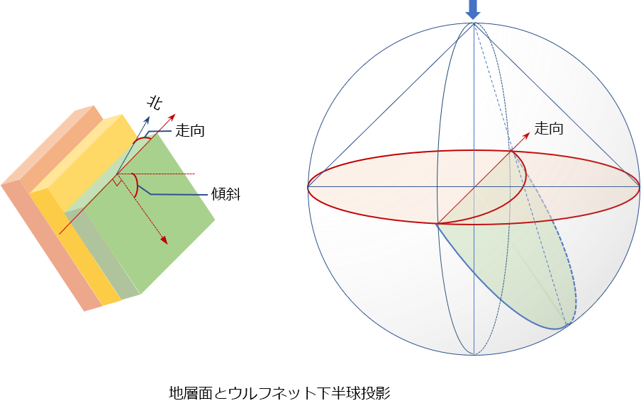
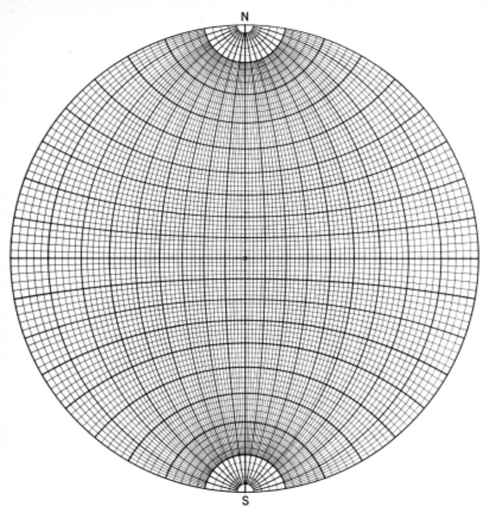

# 8. 地質図学演習（ステレオ投影法による解析）

## ステレオ投影法とは

地質学では、3次元の物質や構造を取り扱いますが、この3次元構造を２次元で表現する方法として、**ステレオ投影法**がよく用いられます。

ステレオ投影法には、**等角投影（ウルフネット）**と**等積投影（シュミットネット）** がありますが、地質図学では地物の位置や方位を取り扱いますので、ウルフネットを使用して構造解析を行います。

  
ウルフネット下半球投影  

  
ウルフネット  

### 【演習４】ステレオ投影による見掛けの傾斜の求め方を理解する

前章の断面図に表れる見掛けの傾斜をウルフネットを用いて求めなさい。

  
見掛けの傾斜を求める  

### 【演習５】ステレオ投影による真の走向傾斜の求め方を理解する  

ある露頭で直接地層面の走向・傾斜の測定が行えなかったので、２つの見掛けの走向・傾斜を測定しました。  
測定結果は、それぞれ N45W 30SW、N14E 22E でした。  
ウルフネットを用いて真の走向・傾斜を求めなさい。

