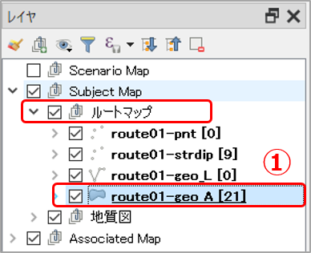
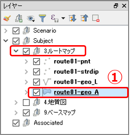
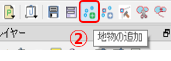
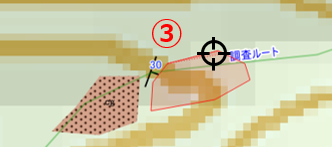
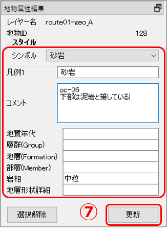

# 10. QGISでルートマップを作る

## QGISでのルートマップの作成法

野外調査の結果をルートマップとしてQGISで作成するには「Subject」レイヤーグループ内に「ルートマップ」レイヤーグループを作成し、その中の各レイヤーに以下のように記録していきます。

1. 走向・傾斜データは「strdip」レイヤーに地物を作成して記録する。  
2. 露頭の分布や観察メモは「geo\_A」レイヤーに地物を作成して記録する。  
3. 断層などの線構造は「geo\_L」レイヤーに地物を作成して記録する。  

----
**【演習用ダウンロードファイル】**  
[**QGISサンプルプロジェクト**](./files/project_chapter10.zip)：演習１のQGISプロジェクトファイル（ZIPファイル）  

----

### 【演習1】QGISでのルートマップの作成法を理解する

サンプルプロジェクトファイルを用いて、QGISでルートマップを作成してみましょう。

#### 1.露頭の走向・傾斜を記録する(strdipレイヤー)

下図のNo.03とNo.06の露頭の走向・傾斜データはまだQGISに記録されていません。  
この露頭の走向・傾斜を「ルートマップ」レイヤーに記録してみましょう。

以下の手順で行います。

① 「レイヤーパネル」の **[Subject Map]-[ルートマップ]** を展開し、**route01-strdip**レイヤーをクリックして選択します。

> 「Subject Map」グループに作成された地質図用マップは以下の4つのレイヤーから成っています。  
> -pnt :点（ポイント）レイヤー。観測場所の点情報を表します。  
> -strdip :点（ポイント）レイヤー。走向・傾斜の点情報を表します。  
> -geo\_L :線（ライン）レイヤー。地層の境界線などの線情報を表します。  
> -geo\_A :ポリゴンレイヤー。露頭や地層面などの面情報を表します。  
> 編集を行う場合は、各々のレイヤーを選択してください。

② ツールバーの **[Add Feature（地物の追加）]** をクリックして、**「追加モード」** にします。

  

③ マップキャンバス上で、走向・傾斜を記録したい場所にマウスカーソルを移動してクリックして、点を追加します。  

  

④ ツールバー **[Add Feature（地物の追加）]** をクリックして追加モードから抜けます。  

⑤ ツールバーの **[Edit Attribute（地物属性の編集）]** をクリックして、「地物属性編集パネル」を表示します。  

  

⑥ ③で作成した点を選択（マウスでクリックまたは範囲選択）します。  

⑦ 走向・傾斜の属性を入力して、**[更新]** をクリックします。  

  

マップキャンバス上で追加した③の点が、走向・傾斜マークに変わっていることを確認します。  

  

> マップキャンバスの表示範囲を変えるには、以下のいずれかで行います。  
> <b>・地図表示移動:</b> キーボードの[矢印]キーを押下、または[スペース]を押しながらマウスでドラッグ  
> <b>・ズームイン・アウト:</b> [PgUp][PgDn]キー、またはマウスホイールを回転  

#### 2.露頭の岩相を記録する(geo_Aレイヤー)  

下図のNo.03とNo.06の露頭の岩相を「ルートマップ」レイヤーに記録してみましょう。  

  

① 「レイヤーパネル」の **[Subject Map]-[ルートマップ]** を展開し、**route01-geo_A**レイヤーをクリックして選択します。  

  

② ツールバー **[Add Feature（地物の追加）]** をクリックして **「追加モード」** にします。  

  

③  マップキャンバス上で、露頭を記録したい場所にマウスカーソルを移動して、露頭の範囲を多角形を作るようにクリックしていきます。最後は右クリックして確定します。  

  

④ ツールバー **[Add Feature（地物の追加）]** をクリックして追加モードから抜けます。 

⑤ ツールバーの **[Edit Attribute（地物属性の編集）]** をクリックして、「地物属性編集パネル」を表示します。  

  

⑥ ③で作成した点を選択（マウスでクリックまたは範囲選択）します。  

⑦ 岩相の属性を入力して、**[更新]** をクリックします。  

  

⑧ マップキャンバス上で追加した③のポリゴンが、選択した岩相のシンボルに変わっていることを確認します。  

> 作成した地物の移動・変形・削除などは、ツールバーの各種編集ツールにて行えます。
操作の詳細は、プラグインのヘルプファイルを参照ください。  

