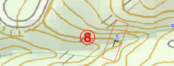

# 10. QGISでルートマップを作る

## QGISでのルートマップの作成法

野外調査の結果をルートマップとしてQGISで作成するには「Subject」レイヤーグループ内に「ルートマップ」レイヤーグループを作成し、その中の各レイヤーに以下のように記録していきます。

1. 走向・傾斜データは「strdip」レイヤーに地物を作成して記録する。  
2. 露頭の分布や観察メモは「geo\_A」レイヤーに地物を作成して記録する。  
3. 断層などの線構造は「geo\_L」レイヤーに地物を作成して記録する。  

### 【演習1】QGISでのルートマップの作成法を理解する

サンプルプロジェクトファイルを用いて、QGISでルートマップを作成してみましょう。

#### 1.露頭の走向・傾斜を記録する(strdipレイヤー)

下図のNo.03とNo.06の露頭の走向・傾斜を「ルートマップ」レイヤーに記録してみましょう。

以下の手順で行います。

① 「レイヤーパネル」の\[Subject\]-\[3.ルートマップ\]を展開し、route01-strdip」レイヤーをクリックして選択します。

> 「Subject」グループに作成されたマップは以下の4つのレイヤーから成っています。  
> -pnt :点（ポイント）レイヤー。観測場所の点情報を表します。  
> -strdip :点（ポイント）レイヤー。走向・傾斜の点情報を表します。  
> -geo\_L :線（ライン）レイヤー。地層の境界線などの線情報を表します。  
> -geo\_A :ポリゴンレイヤー。露頭や地層面などの面情報を表します。  
> 編集を行う場合は、各々のレイヤーを選択してください。

② ツールバーの \[地物の追加\] をクリックして、「追加モード」にします。

  

③ マップキャンバス上で、走向・傾斜を記録したい場所にマウスカーソルを移動してクリックして、点を追加します。③ マップキャンバス上で、走向・傾斜を記録したい場所にマウスカーソルを移動してクリックして、点を追加します。

  

④ ツールバー[地物の追加] をクリックして追加モードから抜けます。  

⑤ ③で作成した点を選択（マウスでクリックまたは範囲選択）します。  

⑥ ツールバーの [地物属性の編集] をクリックして、「属性編集ダイアログ」を表示します。  

  

⑦ 走向・傾斜の属性を入力して、[OK] をクリックします。  

  

マップキャンバス上で追加した③の点が、走向・傾斜マークに変わっていることを確認します。  

  

> マップキャンバスの表示範囲を変えるには、以下のいずれかで行います。  
> <b>・地図表示移動:</b> キーボードの[矢印]キーを押下、または[スペース]を押しながらマウスでドラッグ  
> <b>・ズームイン・アウト:</b> [PgUp][PgDn]キー、またはマウスホイールを回転  
