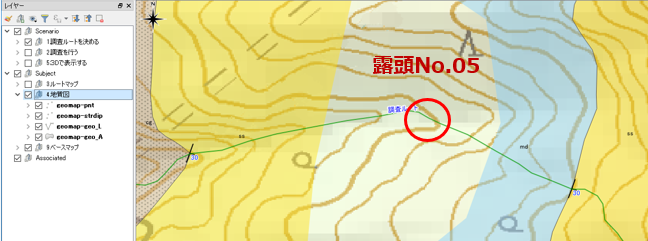
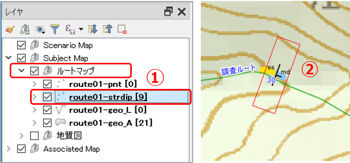
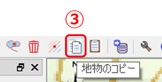
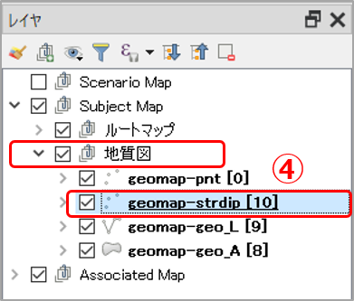
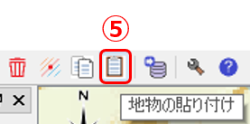
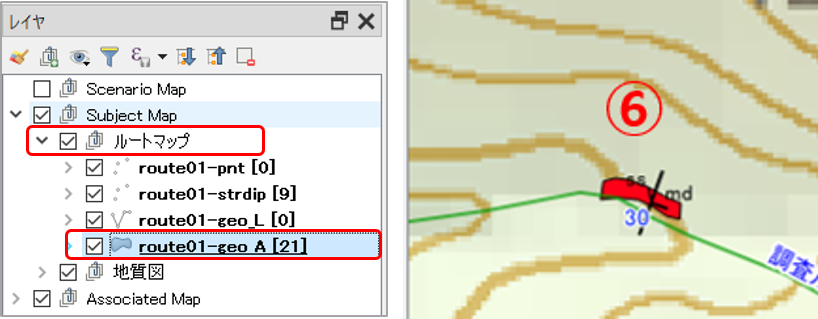
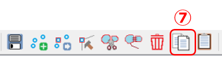
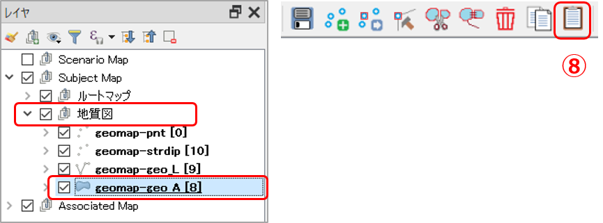

# 11. QGISで地質図を作成する（１）

## ルートマップをもとに地質図を作成する

QGISでは、ルートマップと地質図は別のレイヤーに記録するようにします。これにより、観測元データを保持しておくとともに、データの追加・修正、見直しなどが行えるようにしておきます。

ルートマップのデータをもとに地質図を以下の手順で作成します。

1. 「地質図」レイヤーを作成します。  
2. 「ルートマップ」レイヤーのデータを 1.で作成した「地質図」レイヤーにコピーします。 
3. 地質図学を使い、「地質図」レイヤーに地質境界線や地層を追加・編集します。  

----
**【演習用ダウンロードファイル】**  
[**QGISサンプルプロジェクト**](https://gis.nsb-dank.co.jp/qgis/project_chapter11.zip)：演習１のQGISプロジェクトファイル（ZIPファイル）  

----  

## 【演習1】QGISでの地質境界線の描画法を理解する

前章の演習1で作成したルートマップをもとに、地質図レイヤーに地層境界線を描画しましょう。

#### 1.ルートマップデータを地質図レイヤーにコピーする

「ルートマップ」レイヤーにある露頭No.05の走向・傾斜と岩相データを「地質図」レイヤーにコピーしましょう。

①「レイヤーパネル」の **[Subject Map]-[ルートマップ]** を展開し、**route01-strdip**レイヤーをクリックして選択します。

②露頭No.05 の走向・傾斜データを選択します。

③ツールバー **[copy Features（地物のコピー）]** をクリックします。 これで、②の走向・傾斜データがクリップボードにコピーされました。

④「レイヤーパネル」の **[Subject Map]-[地質図]** を展開し、**geomap-strdip**レイヤーをクリックして選択します。

⑤ツールバー **[Paste Features（地物の貼り付け）]** をクリックします。 これで、走向・傾斜データが地質図レイヤーにコピーされました。

同様に、ルートマップにある岩相データも地質図レイヤーにコピーします。

⑥レイヤーパネル **[Subject Map]-[ルートマップ]** グループの **route01-geo_A** レイヤーを選択し、露頭No.05の砂岩および泥岩のポリゴンを選択します。

⑦ツールバー **[Copy Feature（地物のコピー）]** をクリックします。

⑧レイヤーパネル **[Subject Map]-[地質図]** グループの**geomap-geo_A**レイヤーを選択し、ツールバーの **[Paset Features（地物の貼り付け）]** をクリックします。

  

#### 2.地質境界線を描画する

上記でルートマップレイヤーからコピーした露頭No.05 の走向・傾斜データをもとに、地質図学を用いて地質図上に地質境界線を描画します。

第７章の演習２で行った要領で、「地質図」レイヤーの露頭No.5付近の地質境界線を描画しましょう。  

### 【演習2】実際の調査結果をもとにQGISで地質境界線を描画する

実際にフィールド調査を行い、調査結果をもとにQGISでルートマップの作成から地質境界線の作成までを行ってみましょう。

