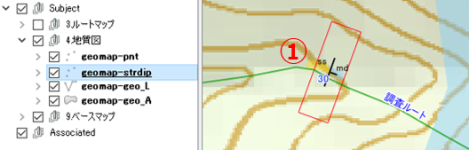
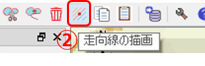
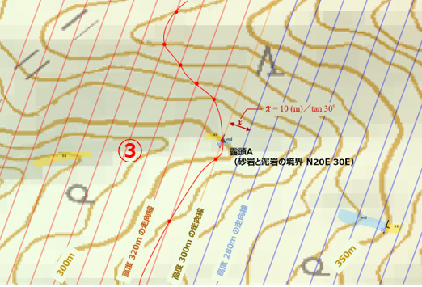
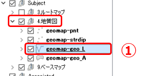
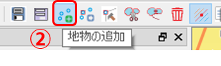
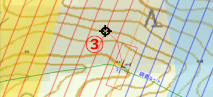
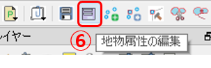
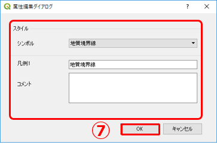

# 11. QGISで地質図を作成する（１）

## ルートマップをもとに地質図を作成する

QGISでは、ルートマップと地質図は別のレイヤーに記録するようにします。これにより、観測元データを保持しておくとともに、データの追加・修正、見直しなどが行えるようにしておきます。

ルートマップのデータをもとに地質図を以下の手順で作成します。

1. 「地質図」レイヤーを作成します。  
2. 「ルートマップ」レイヤーのデータを 1.で作成した「地質図」レイヤーにコピーします。 
3. 地質図学を使い、「地質図」レイヤーに地質境界線や地層を追加・編集します。

## 【演習1】QGISでの地質境界線の描画法を理解する

前章の演習1で作成したルートマップをもとに、地質図レイヤーに地層境界線を描画しましょう。

#### 1.ルートマップデータを地質図レイヤーにコピーする

「ルートマップ」レイヤーにある露頭No.05の走向・傾斜と岩相データを「地質図」レイヤーにコピーしましょう。

①「レイヤーパネル」の\[Subject\]-\[3.ルートマップ\]を展開し、「route01-strdip」レイヤーをクリックして選択します。

②露頭No.05 の走向・傾斜データを選択します。

③ツールバー\[地物のコピー\] をクリックします。 これで、②の走向・傾斜データがクリップボードにコピーされました。

④「レイヤーパネル」の\[Subject\]-\[4.地質図\]を展開し、「geomap-strdip」レイヤーをクリックして選択します。

⑤ツールバー\[地物の貼り付け\] をクリックします。 これで、走向・傾斜データが地質図レイヤーにコピーされました。

同様に、ルートマップにある岩相データも地質図レイヤーにコピーします。

⑥レイヤーパネル\[Subject\]-\[3.ルートマップ\]グループの「route01-geo\_A」レイヤーを選択し、露頭No.05の砂岩および泥岩のポリゴンを選択します。

⑦ツールバー\[地物のコピー\] をクリックします。

⑧レイヤーパネル\[Subject\]-\[4.地質図\]グループの「geomap-geo\_A」レイヤーを選択し、ツールバーの \[地物の貼り付け\] をクリックします。

#### 2.地質境界線を描画する

前頁で地質図にコピーした露頭No.05 の走向・傾斜データをもとに、地質図学を用いて地質図上に地質境界線を描画します。

まず、露頭No.05の走向・傾斜をもとに走向線を描画します。

① 「レイヤーパネル」の\[Subject\]-\[4.地質図\]グループの「geomap-strdip」レイヤーを選択し、露頭No.05の走向・傾斜を選択します。

② ツールバー\[走向線の描画\] をクリックします。

 

③ マップキャンバス上に走向線が描画されます。

上記で描画した走向線をもとに、地質境界線を描画します。  
以下の手順で行います。

①「レイヤーパネル」の\[Subject\]-\[4.地質図\]グループの「geomap-geo\_L」レイヤーを選択します。

② ツールバー\[地物の追加\] をクリックして「追加モード」にします。

③ マップキャンバス上で、マウスカーソルを移動して、走向線と等高線の交点をクリックしていきます。最後は右クリックして確定します。

④ ツールバー\[地物の追加\] をクリックして追加モードから抜けます。

⑤ ③で作成した線を選択します。

⑥ツールバーの \[地物属性の編集\] をクリックして、「属性編集ダイアログ」を表示します。

⑦ 境界線の属性を入力して、\[OK\] をクリックします。

⑧ ②～⑦を繰り返して、境界線を完成させましょう。\[走向線を描画\] をもう一度クリックすると。走向線は消えます。

### 【演習2】実際の調査結果をもとにQGISで地質境界線を描画する

実際にフィールド調査を行い、調査結果をもとにQGISでルートマップの作成から地質境界線の作成までを行ってみましょう。

