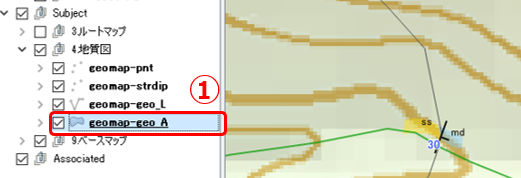
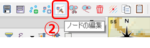
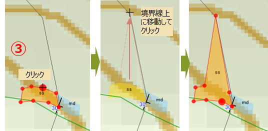
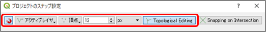

# 12. QGISで地質図を作成する（２）

## QGISで地質のデータ属性を記録する

地質境界線を描いたら、地質面の分布を描画して地質図を完成させます。 また、その地域の地質の特徴を示すようなデータ属性があれば、その地物を作成して地質図上に表示させると分かりやすい地質になるでしょう。

### 【演習1】QGISでの地質面の描画方法を理解する

前章の演習1で作成した地質境界線にそって、地質面の分布を描画しましょう。  
露頭No.05 の岩相を前頁で描画した境界線に沿って拡張して、地質面を描画します。

以下の手順で行います。

①「レイヤーパネル」の[Subject\]-[4.地質図]グループの「geomap-geo_A」レイヤーに、[3.ルートマップ]グループの[「route01-geo_A」のデータをコピーします。

②「geomap-geo_A」レイヤーを選択して、ツールバー[ノードの編集] をクリックします。

③マップキャンバス上のポリゴンの近くにマウスカーソルを移動すると、ポリゴンのノード（頂点）が●で表示されます。これをクリックして、変形させたい点にカーソルを移動し、そこでクリックします。

このようにしてポリゴンの形を変形させて地層面を描画していきます。

> ノードの編集の際に、他の図形のノードに密着させる機能を「スナップ機能」といいます。  
> スナップ機能を有効にするには、メニュー\[プロジェクト\]-\[スナップオプション\]でスナップ設定ダイアログを開いて、下図のように設定してください。  
> 境界線や他の地質面と密着させることにより、継ぎ目のないきれいな図形を描画することができます。  
> 

### 【演習2】 実際の調査結果をもとにQGISで地質図を作成する

前章で行った地質境界線の描画に続き、実際に行ったフィールド調査の結果をもとに、QGISで地質図を作成してみましょう。

