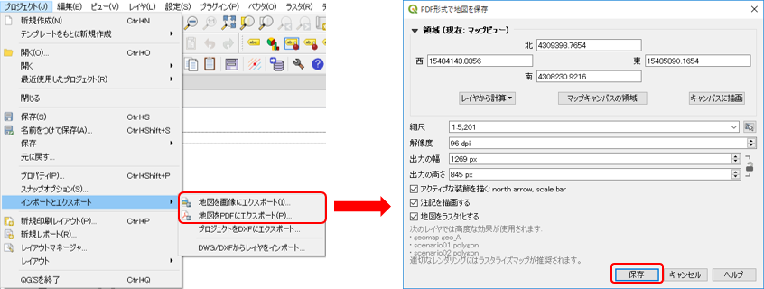
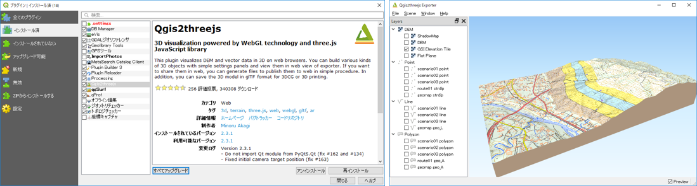
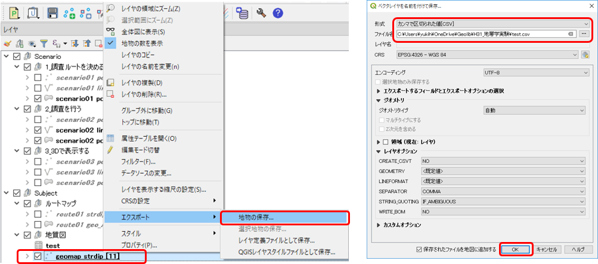

# 13. 調査結果をまとめる

## デジタル地質図を出力する

ラベルやシンボルを編集して、見やすい図面とします。

完成した地質図は以下のようにさまざまな表現で出力することができます。

### PDFや画像に出力する  

作成した地図は、PDFファイルや画像に出力することができます。  

図のように、QGISメニュー **[プロジェクト]-[インポート/エクスポート]** で
 **[地図画像にエクスポート]** または **[地図PDFにエクスポート]** を選択すると、指定した名称のファイルにマップキャンバスで表示されている内容が保存されます。  

  

また「印刷レイアウト」や「レポート」機能を使用して、定型的な出力形式を保存しておくこともできます。

### 立体地質図を出力する  
QIGS Ver.3 からはベクターデータを3次元の位置情報で保存することができ、また、標準で３Ｄマップビューの機能が搭載されました。  
しかし、性能があまり高くないＰＣでは３Ｄビューを表示させると動きが遅く実用に耐えません。  
そこで、本講座では、「[Qgis2three.js](https://plugins.qgis.org/plugins/Qgis2threejs/)」プラグインを使用した３D地図の出力を推奨します。  

左下図のように、メニュー **[プラグイン]-[プラグインの管理とインストール]** で、「Qgis2three.js」プラグインをインストールして有効化してください。これでマップキャンバスで表示されている地図を３Dに出力することができます。 

  

Qgis2three.jsで３D表示するにはDEM（標高）データが必要となりますが、インターネットに接続されている環境であれば「GSI Elevation Tile」を指定して表示できます。  
また、表示された地図は「File」メニューからHTMLファイルとしてマウスを使用して動的に視点を移動できる地図として保存することができます。  

### 属性データをエクスポートする  

QGISに入力した調査情報を測定データを他のソフトやExcelなどで利用（例えば、走向・傾斜データをステレオネットのソフトで利用するなど）したい場合、地物データをCSV形式などのファイルに出力することができます。  
下図のように、レイヤーパネルで出力したいレイヤーを右クリックして表示されるプルダウンメニューで **[エクスポート]-[地物の保存]** を選択します。表示されたダイアログで出力形式やファイル名を指定して **[OK]** をクリックするとファイルに出力されます。

  

### 【演習1】QGISで作成した地図の出力方法を理解する

前章の演習1で作成した地質図を用いて、以下の出力をしてみましょう。

* PDF形式で出力 (プリントコンポーザの使用方法）  
* 3D画像（HTML形式）で出力 （QGIS2Three.jsプラグインの利用）

### 【演習2】実際の調査結果をもとに作成したQGISの地図を出力する

実際に行ったフィールド調査結果をもとに、QGISで地質図を出力してみましょう。

